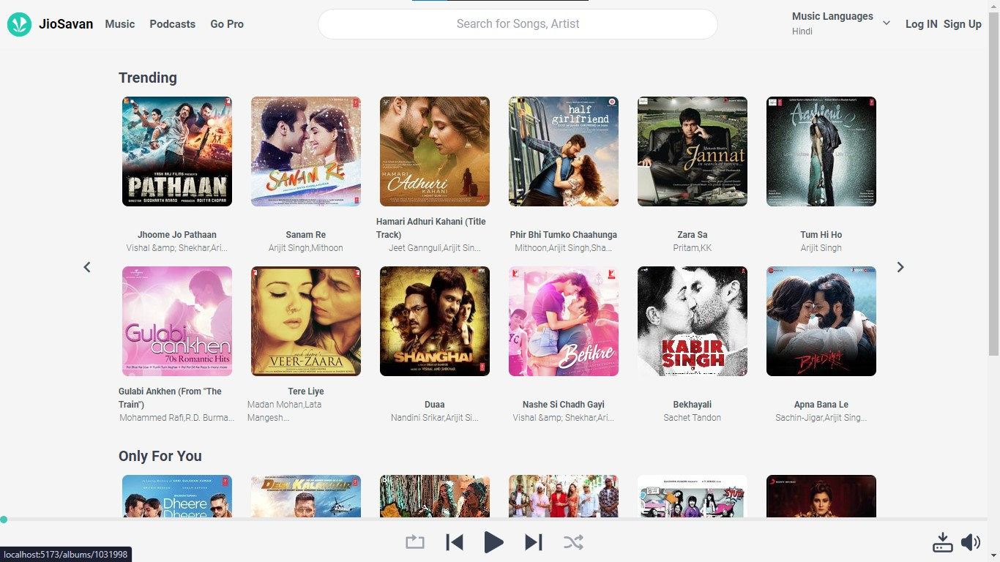
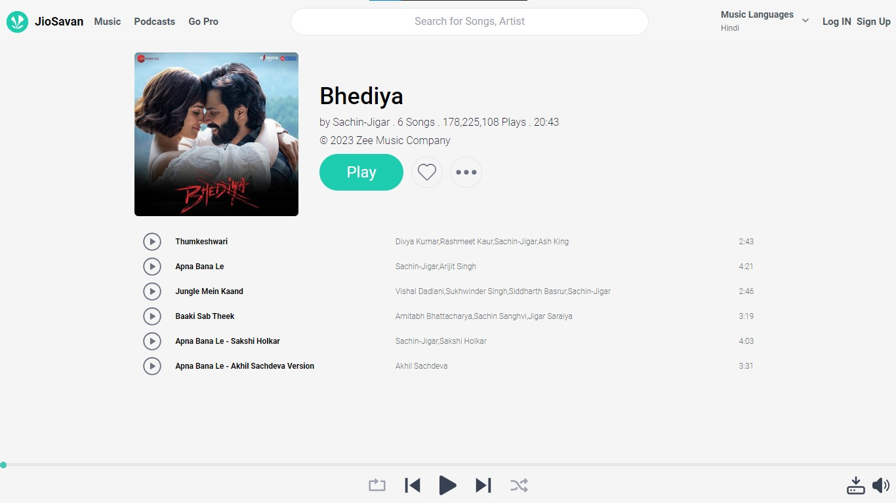
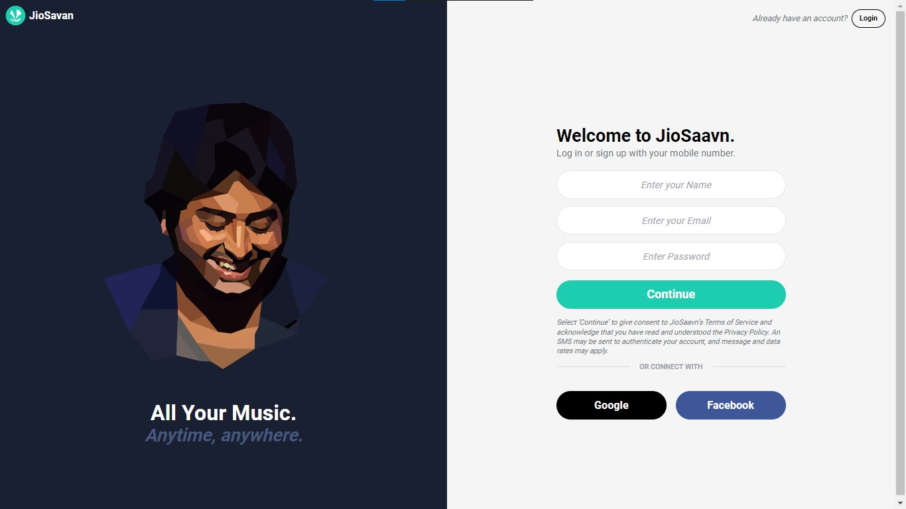
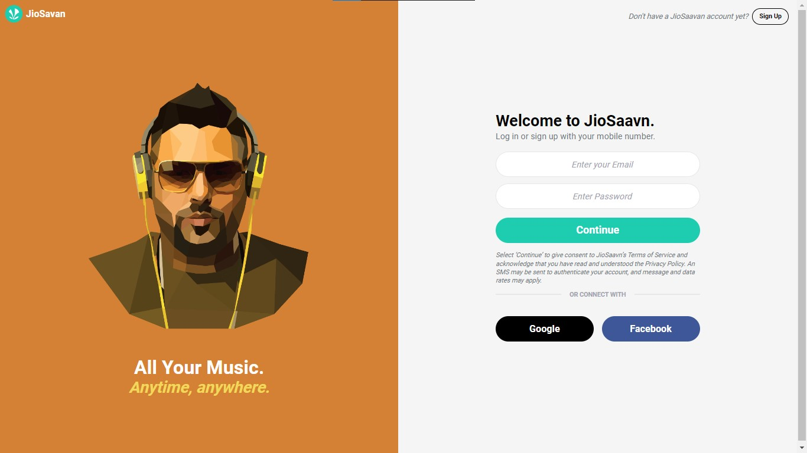
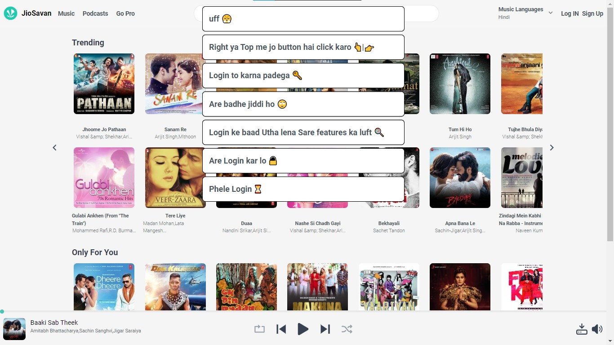
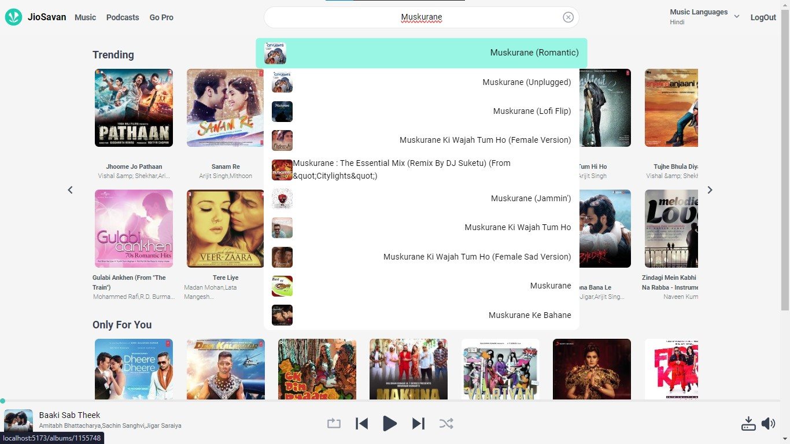
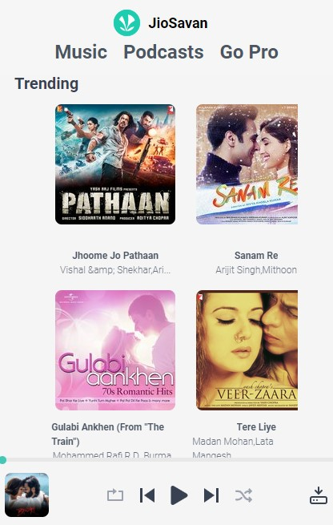
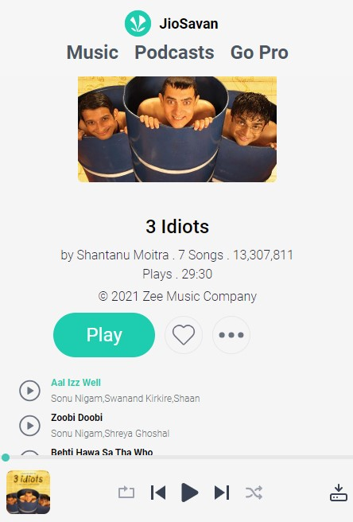

# JioSavaan-like Website

### Welcome to my cool website that resembles JioSaavn, featuring various real-life features, built with React and Tailwind CSS.
## Link **[https://own-music-app.netlify.app/](https://own-music-app.netlify.app/)**

## Dependencies
- react: 18.2.0
- react-dom: 18.2.0
- axios: 1.6.7,
- firebase: 10.8.1,
- react-hot-toast: 2.4.1,
- react-icons: 5.0.1,
- react-router-dom: 6.22.2

## Features
* Songs Play, Pause, Jump to the Next Song or Previous Song progress bar for all the songs.

* SignUp, Login and Logout feature

* You can download any song if you are logged in 

* You can search any song on the search bar it shows the results along with suggestions

* A beautiful shimmer ui while the data is loading

#### User Authentication

- <mark>Register</mark> , <mark>Login</mark> and <mark>Logout</mark> feature

#### Main Landing Page

* Page where you show around 80 songs that you can choose and play along with a navbar with search box where you can search any song 

#### Dynamic Links (with the help of router)

- For every page like: SignUp, Login, Landing page are using Dynamic links when ever user clicks on any of those links it takes to that page without refreshing the page with increases the proformence and your experience

## LANDING PAGE

## ALBUM PAGE

## SIGNUP PAGE

## LOGIN PAGE

## TOAST SHOWING WHEN USE IS NOT LOGGED IN

## SUGGESTIONS 

## MOBILE VIEW
<!-- 
 -->

  

  

 ## Always open for your feedbacks email: [roshanbhagatwork@gmail.com](roshanbhagatwork@gmail.com)

